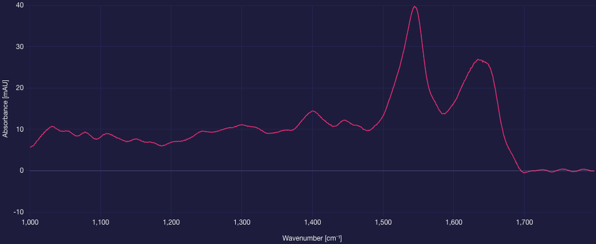

# IRUBIS Coding Challenge

Thank you for taking the time to complete our coding challenge. We know that your time is valuable, and we appreciate you spending some of it with us.

You will have one week to complete the challenge, starting from the moment you receive it. We want to respect your time, so please don't invest more than a few hours at most. You can choose whatever language and tools you feel most comfortable with, but we're mostly working with Python (FastAPI) and JavaScript (React) so these languages would make it easier for us to evaluate your code.

We are aware that the tasks in this challenge can be implemented with AI. We kindly ask you to **NOT use AI tools** for your submission. If we are under the impression that a submission was created with AI, we cannot regard it as technical qualification for the position. This forces us to make the technical interview more challenging, so creating a hand-crafted submission will be to your own benefit!

## Submission

Please **share a GitHub repository** containing your solution with the following GitHub account: [max-demmler](https://github.com/max-demmler).

Don't forget to add information on **how to run your code** in **Part 4**.

Should you need more time or additional information, please feel free to write to us.

## Task

A **spectrometer** is a sensor that uses a light source and a light detector to measure how much light an examined sample absorbs at specific wavenumbers. The output at a point in time is called a **spectrum**. For the following tasks, we consider that a **spectrum** is a **1-dimensional array of 800 float values**, each describing the amount of light absorbed at a specific wavenumber.

Here is an example of a spectrum:

### Part 1: Spectrometer Simulation

Since we don't expect you to have a spectrometer at hand, we want you to implement a spectrometer simulation.

You can find a [spectra.csv](spectra.csv) file with pre-recorded spectra. The first column contains **timestamps**, all other columns are **spectral absorbance values** at specific wavenumbers (1000-1799 cm^-1). Each row is a **timestamp-spectrum pair**. Rows are ordered by timestamp.

Implement a **replay simulation** that iterates over the data points from the CSV file in real-time speed (using the same time resolution as in the CSV data). The simulation should run in a continuous cycle, i.e the simulation time should reset to the first timestamp after reaching `2026-04-10T14:17:10.000`.

Furthermore, your spectrometer simulation should have **control functionality** to start/continue and stop.

### Part 2: REST API

Implement a **REST API** that exposes the **control functionality** from Task 1, as well as the ability to **get the latest spectrum** and to **set the simulation time**.

### Part 3: UI (Optional)

We appreciate you following along so far! This part is **optional**. If you have time, we would like you to implement a **simple UI** that visualizes the current spectrum and/or control functionality in a meaningful way.

### Part 4: How to Run Your Code

Please replace this with necessary **information to run your code** and include it in your submission.